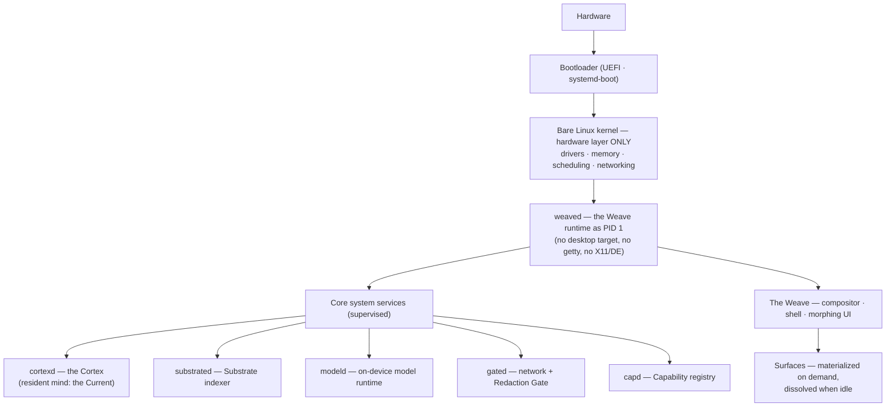

# 02 — System Architecture

Morph is a standalone operating system. This document describes the full stack from
hardware to Surfaces and the canonical data flow that every other document elaborates.

## The stack, bottom to top



**Layer contract:** the Linux kernel supplies hardware truth and nothing else. Every
convention above it — sessions, windows, apps, launchers, shells — is discarded and
replaced. The Weave *is* the userland. Details in [03-os-layer.md](03-os-layer.md).

## The two planes

Morph separates cleanly into:

- **The experience plane** — the Weave and its Surfaces. Everything the user sees.
  Stateless by design; it can crash and repaint without losing anything.
- **The mind plane** — the supervised services (`cortexd`, `substrated`, `modeld`,
  `gated`, `capd`) plus the durable stores (Substrate index, Context Graph, Memory,
  the Current, the Journal). Everything the system *knows* and *does*.

All durable state lives in the mind plane. A Surface holds no state worth saving; the
moment it matters, it is written to the Journal, the Context Graph, or the Substrate.
This is what makes "tools exist when needed and not when not" safe rather than lossy.

## The eight AI subsystems

Coordinated by the Cortex, loosely coupled through an event bus and the Context Graph
(full detail in [04-ai-architecture.md](04-ai-architecture.md)):

| Subsystem | One-line responsibility |
|---|---|
| **Cortex** | Signals → Intent → Plan. The resident orchestrator. |
| **Facet Resolution** | What *is* this content? Semantic typing with confidence. |
| **Capability Registry & Materializer** | Catalog of tools; forms and dissolves Surfaces. |
| **Foresight** | Related content + likely next actions. |
| **The Weave** | Composes Stage, Tool Halo, Foresight Rail, Intent Bar. |
| **The Substrate** | Semantic filesystem + index over the base FS. |
| **The Memory** | Long-term user model: habits, preferences, corrections. |
| **The Context Graph** | The connective graph everything reads and writes. |

## Canonical data flow: "the user opens a photo"

```mermaid
sequenceDiagram
    participant U as User
    participant W as Weave
    participant C as Cortex (cortexd)
    participant F as Facet Resolution
    participant FS as Foresight
    participant M as Materializer
    participant G as Context Graph / Memory / Current

    U->>W: focuses a photo
    W->>C: focus event
    C->>F: resolve facets
    F-->>C: image (0.98)
    C->>G: consult the Current + Memory + Graph
    G-->>C: "beach trip thread active; user edits then shares photos"
    Note over C: on-device router forms Intent:<br/>"view/curate image" — no cloud needed
    C->>M: Plan: materialize [view, adjust, annotate, share]
    C->>FS: related content + next actions?
    FS-->>W: 6 photos, same shoot · "Make a collage?" (0.74)
    M-->>W: Surfaces materialize into the Tool Halo
    W-->>U: Stage: photo · Halo: tools · Rail: related + suggestion
    U->>W: acts (crops, shares, or dismisses)
    W->>G: outcome → Current, Journal, Context Graph, Memory
    Note over W,M: focus lost / idle → Surfaces dissolve<br/>(state already persisted)
```

Six properties of this flow define the whole system:

1. **Everything routes through the Cortex** — one place forms Intent, one place plans.
2. **The Current is consulted before anything is guessed.** The morning's context shapes
   the afternoon's interpretation ([05-resident-mind.md](05-resident-mind.md)).
3. **Local first, cloud by exception.** The router escalates to cloud reasoning only for
   ambiguous or heavy work, through the Redaction Gate ([06-hybrid-ai.md](06-hybrid-ai.md)).
4. **Surfaces are disposable; outcomes are durable.** The Journal records the action;
   Memory records the habit; the Graph records the relationship.
5. **Every suggestion carries its why and its confidence.** Prominence scales with
   confidence ([07-interaction-model.md](07-interaction-model.md)).
6. **Every action is undoable** — or explicitly gated if it cannot be
   ([08-data-knowledge-model.md](08-data-knowledge-model.md), the Journal).

## Process & failure model

- `weaved` (PID 1) supervises everything; a crashed service restarts with backoff.
- The Weave can crash and repaint from the mind plane's state in under a second —
  the experience plane is a pure function of durable state plus the active Plan.
- `cortexd` down ⇒ the Weave degrades to a direct, honest browser of the Substrate
  (content still opens; nothing predicts). The OS never becomes *less* than a computer.
- `modeld` down or model missing ⇒ deterministic Facet heuristics only; Foresight pauses.
- Network down ⇒ Airgapped behavior automatically; cloud-marked plans queue or degrade.

---
*Next: [03-os-layer.md](03-os-layer.md) — boot, PID 1, and the hardware abstraction.*
