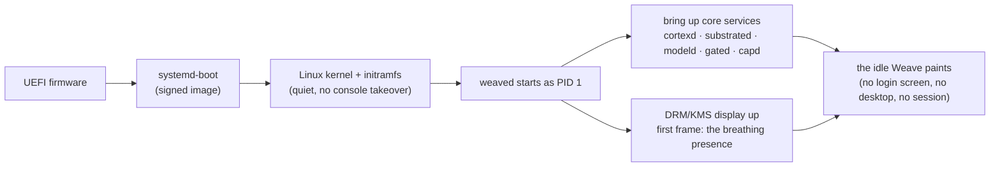

# 03 — The OS Layer: Its Own Operating System

Morph is booted, not launched. This document specifies the layer that makes that true:
the boot path, the init design, the hardware abstraction, and precisely what "throwing
away the userland" means.

## Why a Linux kernel, and only a Linux kernel

Writing a kernel means writing drivers — GPUs, Wi-Fi radios, storage controllers, webcams —
a decade of work that buys the vision nothing. The Linux kernel is used **strictly as the
hardware layer**: process scheduling, memory management, device drivers, the network stack.
Every *convention* that normally comes with Linux is discarded:

| Discarded | Replaced by |
|---|---|
| systemd user sessions, login, getty | `weaved` as PID 1; the machine boots into the Weave |
| X11 / desktop environments / window managers | The Weave: one GPU-rendered morphing canvas |
| Terminal shells as the user interface | The Intent Bar (natural language) + direct manipulation |
| Applications, launchers, docks | Capabilities materialized as Surfaces |
| The file manager | The Substrate, navigated by meaning |

The result is honestly *its own OS*: nothing above the syscall boundary is inherited.
If a from-scratch or non-Linux kernel ever becomes worthwhile, the interface Morph
depends on is narrow (syscalls + the device classes below) — the mind plane and the
Weave would not know the difference.

## Boot flow

- **Target: first frame < 3s, interactive Weave < 10s** on commodity hardware. `modeld`
  warms the on-device model in the background; the Weave is interactive before the mind
  is fully warm and says so honestly (the presence indicator shows "waking").
- **Single-user by design** (v1): the machine *is* the person's computer. Disk encryption
  unlock happens at boot; there is no login-session concept to inherit.
- **No console handoff**: the kernel is configured quiet; the first thing a user ever
  sees is Morph. (`00-boot.html` in the mockups shows this sequence.)

## `weaved`: init, supervisor, compositor host

PID 1 is deliberately small: reap zombies, supervise services, own the display. It is
**not** systemd; it is a purpose-built Rust init (~the scope of runit) because Morph's
service graph is tiny and fixed:

| Service | Role | Restart policy |
|---|---|---|
| `cortexd` | The Cortex: the Current, intent, planning | always; state journaled |
| `substrated` | Substrate indexing + watchers over the base FS | always |
| `modeld` | On-device LLM + embedding runtime | always; Weave degrades gracefully |
| `gated` | Network egress + the Redaction Gate — the *only* path to the internet | always |
| `capd` | Capability registry, manifest validation, permission enforcement | always |
| `dreamd` | Dreamtime scheduler (runs consolidation when idle/charging) | on-demand |

Every mind-plane service is sandboxed (namespaces, seccomp, cgroups) with least-privilege
mounts. Only `gated` has network egress. Capability tool bindings execute inside `capd`'s
sandboxes with the scopes their manifests declare — see [09-privacy-trust.md](09-privacy-trust.md).

## Hardware abstraction

The kernel provides drivers; a thin HAL exposes five device classes to the Weave and services:

| Class | Kernel interface | Consumer |
|---|---|---|
| Display | DRM/KMS, GBM | The Weave renders directly — GPU-accelerated, no display server between it and the kernel. (wlroots is used as a library for DRM/input plumbing, not as a "compositor for clients" — there are no client apps.) |
| Input | evdev via libinput | The Weave: pointer, keyboard, touch; keyboard-first Intent Bar |
| Storage | block devices, btrfs | Base FS + Substrate index volumes |
| Network | netlink, sockets | `gated` only |
| Audio | ALSA (+ PipeWire later for capture) | Surfaces that need playback/capture, via `capd` scopes |

## The userland replacement, precisely

- There is **no app model**: no launchable third-party processes with their own windows.
  The unit of extension is the **Capability manifest**; its tool bindings run as sandboxed
  workers under `capd`, and its UI is a **Surface** the Weave composites. Third parties
  extend Morph by publishing Capabilities, not by shipping apps.
- There is **no window management** because there are no windows: the Weave lays out the
  Stage, Tool Halo, Foresight Rail, and Intent Bar itself ([07-interaction-model.md](07-interaction-model.md)).
- Background work — indexing, inference, sync, Dreamtime — runs as supervised services,
  invisible except through the presence indicator and the Journal.
- **Escape hatch, honestly:** a maintenance console (kernel VT, toggled by a recovery
  keychord) exists for repair. It is a service door, not a second interface.

## Updates & integrity

- **Image-based A/B updates**: the OS is one signed, immutable image; updates write the
  inactive slot and reboot into it; failure rolls back automatically. User data (base FS,
  Substrate index, Memory, Journal) lives on a separate volume untouched by updates.
- Verified boot from firmware to image signature. The mind's stores are encrypted at rest.

## First target hardware

**QEMU/KVM with virtio-gpu** is the Phase-1 reference machine — boot, DRM rendering, and
the full mind plane run unmodified there. Real-hardware bring-up (a single well-supported
x86 laptop) is a Phase-2 gate, chosen precisely because the kernel carries the driver burden.

---
*Next: [04-ai-architecture.md](04-ai-architecture.md) — the eight subsystems of the mind.*
