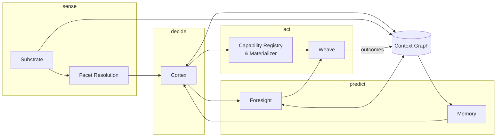

# 04 — AI Architecture: The Eight Subsystems

The mind plane is eight subsystems, loosely coupled through an event bus and the Context
Graph, coordinated by the Cortex. This document defines each one's responsibilities,
inputs, and outputs. The resident-mind behaviors that make the system *living* — the
Current, Dreamtime, the Workbench, Curiosity, Delegation — are specified in
[05-resident-mind.md](05-resident-mind.md).

## 1. The Cortex (`cortexd`)

**Signals → Intent → Plan.** The resident orchestrator.

- **Inputs:** focus events (content opened/selected/multi-selected), Intent Bar utterances,
  ambient context (time, active thread, connectivity, power), the Current, Memory, the
  Context Graph, Facet results.
- **Outputs:** an **Intent** and a **Plan**.

```jsonc
// Intent — the atomic unit of reasoning
{
  "id": "int_8f2c",
  "interpretation": "curate-and-share images from the beach shoot",
  "subject": ["sub:item/ph_0142", "..."],
  "confidence": 0.86,
  "signals": ["focus:image", "current:beach-trip-thread", "memory:edit-then-share"],
  "engine": "local"            // which tier formed it — see 06-hybrid-ai.md
}

// Plan — what to do about it
{
  "intent": "int_8f2c",
  "materialize": ["cap.image.adjust", "cap.image.annotate", "cap.share.send"],
  "foresight": { "related": true, "nextActions": true },
  "escalation": null,           // or {engine:"cloud", reason, redactions[]}
  "attentionCost": 1            // drawn from the attention budget
}
```

The Cortex is a **policy engine and planner, not a chat loop**. Conversation (the Intent
Bar) is one signal source among several. It is also the *only* subsystem that decides —
everything else senses, stores, predicts, or renders.

## 2. Facet Resolution

**What is this content?** Three tiers, cheapest first; each emits Facets with confidence:

1. **Deterministic:** magic bytes, extension, structure heuristics — microseconds.
2. **On-device model:** semantic classification (this PDF is an *invoice*; this `.txt`
   is a *to-do list*; this PNG is a *screenshot of code*) — milliseconds.
3. **Cloud (rare):** only when confidence is low *and* the Plan needs the distinction.

Facets are additive, not exclusive — a screenshot of code is both `image` and `code`, and
both sets of Capabilities become eligible. Facets are cached on the Substrate item and
re-resolved on content change.

## 3. Capability Registry & Materializer (`capd`)

**The catalog of tools, and the hands that form them.**

- Validates and stores Capability manifests ([06-hybrid-ai.md](06-hybrid-ai.md) defines
  the manifest schema); indexes them by Facet predicates and intent triggers.
- Given a Plan, resolves each named Capability against the focused content, checks its
  permission scopes, binds its tools in a sandbox, and hands the Weave a **Surface** to
  composite.
- Tears Surfaces down on idle/focus-loss (**Dissolve**), flushing nothing — durable state
  was never in the Surface.
- Enforcement point for per-Capability permissions; every tool invocation is journaled.

## 4. Foresight

**Two prediction streams, both cheap and local by default:**

- **Related content** — embedding similarity + Context Graph traversal + time/entity
  clustering. "The rest of the shoot," "the other invoices from this sender."
- **Next actions** — habit statistics from Memory (Capability co-occurrence and sequence
  with decay) conditioned on the Current. "You usually resize, then send."

Each suggestion is emitted as `{what, why, confidence}`; the Weave renders prominence
proportional to confidence and shows the *why* on demand. Foresight also **pre-warms**:
high-confidence Surfaces are prepared hidden so materialization feels instant. It never
*acts* — acting requires the Cortex to plan it and, beyond thresholds, Curiosity to ask.

## 5. The Weave

**The composer.** Takes (focused content, active Surfaces, Foresight output, presence
state) and lays out the four zones — Stage, Tool Halo, Foresight Rail, Intent Bar — with
Materialize/Dissolve as first-class animations. The experience plane is a pure function
of mind-plane state; it holds nothing durable. Interaction rules live in
[07-interaction-model.md](07-interaction-model.md).

## 6. The Substrate (`substrated`)

**Content, addressable by meaning.** Watches the base filesystem, maintains the index
(vector + metadata + full-text), assigns stable item IDs, extracts entities, and serves
both path addressing and semantic addressing ("the invoice from March"). Schema in
[08-data-knowledge-model.md](08-data-knowledge-model.md).

## 7. The Memory

**The long-term user model:** preferences (explicit and inferred), habits (with decay),
corrections (every dismissed or corrected suggestion, with its lesson: *not now* / *never*
/ *wrong tool*), and personal entities (people, projects, places). Written mostly during
Dreamtime; read by the Cortex and Foresight on every Intent. Inspectable and editable
through the Workbench; wipeable as a whole or per-entry.

## 8. The Context Graph

**The connective tissue.** Nodes: content items, Facets, entities, Capability instances,
action events. Edges: `similar-to`, `part-of`, `authored-by`, `sent-to`, `used-with`,
`followed-by` (temporal/causal). Every subsystem writes what it learns; the Cortex and
Foresight traverse it. It is the reason opening one photo can mean something.

## How they compose



One loop, one direction of authority: sense → decide → act, with prediction advising
decide and every outcome flowing back into the graph the next decision will read.

---
*Next: [05-resident-mind.md](05-resident-mind.md) — what makes it alive.*
